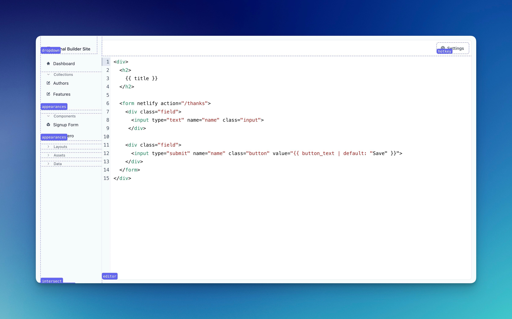

# Rails and Hotwire Development Tool

A small, but nifty little tool to help you with Rails and Hotwire development.




## What can it do?

- `d f`; fill fields with the predefined values;
- `d s`; fill fields and submit the form;
- `d c`; toggle the (web)console;
- `d t`; toggle highlight all Turbo Frames;
- `d e`; toggle highlight all Stimulus Controllers;
- `d x`; copy current URL;
- `d r`; copy the given resource's id (customizable, you can pass anything).


## Install

This tools is packaged as a template. This means its easy to tweak to fit your app even more (but add a PR if your change can help others!).

Run this command in your Rails app:
```bash
bin/rails app:template LOCATION=https://raw.githubusercontent.com/Rails-Designer/rails-hotwire-development-tool/master/template.rb
```

This will create two files:

- app/helpers/development/tool_helper.rb;
- app/javascript/controllers/development/tool_controller.js.

It then tries to install the [@github/hotkey](https://github.com/github/hotkey) package and finally inject the helper into your application layout.


## Sponsored By [Rails Designer](https://railsdesigner.com/)

<a href="https://railsdesigner.com/" target="_blank">
  
</a>
